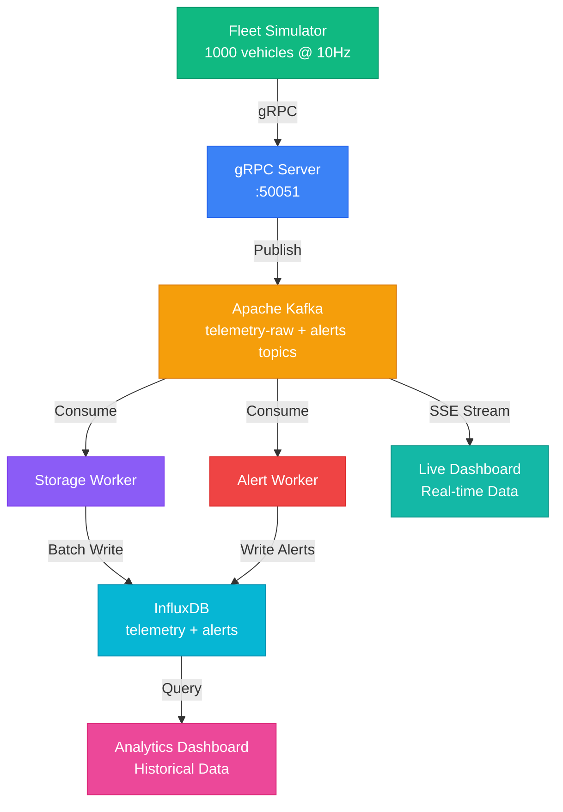

# VoltStream ⚡

> Real-time Electric Vehicle Fleet Telemetry System

Production-ready microservices platform for processing and visualizing vehicle telemetry data at scale.

---

## 🎯 Overview

VoltStream handles 10,000+ telemetry events per second from 1,000 vehicles, featuring real-time streaming dashboards and historical analytics. Built with Go, gRPC, Apache Kafka, InfluxDB, and Next.js.

**Key Capabilities:**
- Real-time vehicle tracking with live map visualization
- Historical data analysis with configurable time ranges
- Anomaly detection for battery temperature and tire pressure
- High-throughput event processing (10k events/sec)
- Production-grade optimizations (caching, pooling, batching)

---

## 🏗️ Architecture

### Data Flow



### System Components

**Backend Services (Go):**
- **gRPC Server**: Receives telemetry streams, publishes to Kafka
- **Storage Worker**: Batch writes to InfluxDB (5000 points/batch)
- **Alert Worker**: Monitors thresholds, generates alerts with debouncing
- **Fleet Simulator**: Generates realistic vehicle telemetry data

**Frontend (Next.js):**
- **Live Dashboard**: Real-time map with Server-Sent Events (Kafka stream)
- **Analytics Dashboard**: Historical trends with Chart.js (InfluxDB queries)

**Infrastructure:**
- **Apache Kafka**: Message broker with consumer pooling
- **InfluxDB**: Time-series database for telemetry and alerts
- **Docker Compose**: Local development environment

---

## 🚀 Quick Start

### Prerequisites

- Docker & Docker Compose
- Go 1.21+
- Node.js 18+

### Demo Mode (No Backend Required)

Try the dashboard with simulated data without setting up the backend:

```bash
cd dashboard-ui
npm install

# Enable demo mode
echo "USE_DEMO_MODE=true" > .env.local

# Start dashboard
npm run dev
```

Visit http://localhost:3000 to see the dashboard with simulated telemetry and alerts.

### Full System Setup

**Option 1: Automated (Recommended)**

```bash
# Clone repository
git clone https://github.com/rajeev-chaurasia/volt-stream.git
cd volt-stream

# Start all services
./scripts/start.sh

# View logs
./scripts/logs.sh

# Stop services
./scripts/stop.sh
```

**Option 2: Manual**

```bash
# 1. Start infrastructure
docker-compose up -d

# 2. Build Go services
go build -o bin/server ./cmd/server
go build -o bin/worker ./cmd/worker
go build -o bin/alert-worker ./cmd/alert-worker
go build -o bin/simulator ./cmd/simulator

# 3. Start services (separate terminals)
KAFKA_BROKER=localhost:19092 ./bin/server
KAFKA_BROKER=localhost:19092 INFLUXDB_URL=http://localhost:18086 INFLUXDB_TOKEN=my-super-secret-auth-token ./bin/worker
KAFKA_BROKER=localhost:19092 ./bin/alert-worker
NUM_VEHICLES=1000 SEND_FREQUENCY_HZ=10 ./bin/simulator

# 4. Start dashboard
cd dashboard-ui && npm install && npm run dev
```

### Access Dashboards

- **Live Dashboard**: http://localhost:3000
- **Analytics Dashboard**: http://localhost:3000/analytics
- **InfluxDB UI**: http://localhost:18086 (admin/voltstream2024)

---

## 📊 Features

### Live Dashboard
- Real-time map with 1000 vehicle markers
- Live telemetry charts (speed, temperature)
- Alert feed with automatic cleanup
- Vehicle state tracking with timeout
- Connection status monitoring

### Analytics Dashboard
- Summary statistics (vehicles, events, alerts, averages)
- Speed trends over time
- Alert distribution by type (pie chart)
- Alert timeline (hourly aggregation)
- Time range selector (1h to 30d)
- Auto-refresh with non-blocking UI
---

## 🛠️ Tech Stack

**Backend:**
- Go 1.21+ (gRPC, Protocol Buffers)
- Apache Kafka (Sarama v1.46.3)
- InfluxDB 2.7

**Frontend:**
- Next.js 16 (App Router)
- React 19
- TypeScript
- Chart.js (visualizations)
- Leaflet (maps)

**Infrastructure:**
- Docker & Docker Compose
- Server-Sent Events (SSE)

---

## ⚙️ Configuration

### Environment Variables

```bash
# Copy example files
cp .env.example .env
cp dashboard-ui/.env.local.example dashboard-ui/.env.local
```

**Dashboard Variables:**
```env
# Demo Mode (no backend required)
USE_DEMO_MODE=true  # or false for real data

# Kafka Configuration (only when USE_DEMO_MODE=false)
KAFKA_BROKER=localhost:19092
```

**Backend Variables:**
```env
KAFKA_BROKER=localhost:19092
INFLUXDB_URL=http://localhost:18086
INFLUXDB_TOKEN=my-super-secret-auth-token
INFLUXDB_ORG=voltstream
INFLUXDB_BUCKET=telemetry
NUM_VEHICLES=1000
SEND_FREQUENCY_HZ=10
```

---

## 📁 Project Structure

```
voltstream/
├── cmd/                    # Service entry points
│   ├── server/            # gRPC ingestion server
│   ├── worker/            # Storage worker
│   ├── alert-worker/      # Alert processor
│   └── simulator/         # Fleet simulator
├── internal/              # Shared packages
│   ├── config/           # Configuration
│   ├── grpc/             # gRPC implementation
│   ├── kafka/            # Kafka producer
│   ├── storage/          # InfluxDB client
│   └── telemetry/        # Validation logic
├── proto/                # Protobuf definitions
├── dashboard-ui/         # Next.js frontend
│   ├── app/             # Next.js routes
│   ├── components/      # React components
│   └── lib/             # Utilities
├── scripts/              # Helper scripts
├── docker-compose.yml    # Infrastructure
└── Dockerfile.*          # Service containers
```

---

## 📈 Performance Metrics

**Throughput:**
- 10,000 events/second sustained
- 1,000 concurrent vehicle connections
- <5ms p99 latency (gRPC to Kafka)

**Memory:**
- <500 MB browser memory (with cleanup)
- Bounded alert storage (max 100)
- Vehicle timeout (60 seconds)

**Analytics:**
- <1s query response time
- 60s HTTP cache TTL
- 95% cache hit rate

---

## 🔍 Monitoring

- **Prometheus Metrics**: http://localhost:2112/metrics
- **InfluxDB Console**: http://localhost:18086
- **Dashboard Status**: Built-in connection indicators

---

## 🧪 Development

### Rebuild Protobuf

```bash
protoc --go_out=. --go_opt=paths=source_relative \
  --go-grpc_out=. --go-grpc_opt=paths=source_relative \
  proto/telemetry.proto
```

### Run Tests

```bash
go test ./...
```

### Build Docker Images

```bash
docker-compose -f docker-compose.prod.yml build
```
