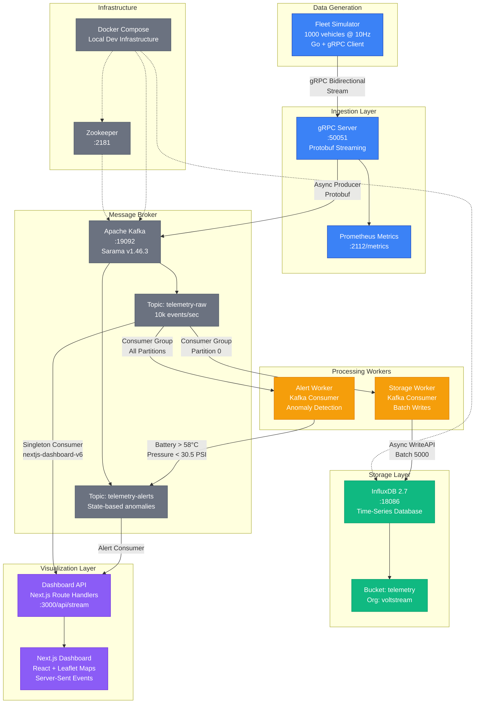

# VoltStream ⚡

High-performance vehicle telemetry ingestion and monitoring system for electric vehicle fleets.

## Overview

VoltStream processes 10,000+ telemetry events per second from 1,000 simulated vehicles, demonstrating a production-ready microservices architecture with real-time visualization. Built with Go, gRPC, Apache Kafka, InfluxDB, and Next.js.

## Features

- **High Throughput**: 10k+ events/sec with sub-millisecond gRPC ingestion
- **Real-time Dashboard**: Live map tracking 1000 vehicles with instant updates
- **Anomaly Detection**: Battery overheat and tire pressure monitoring with state tracking
- **Memory Efficient**: Automatic cleanup prevents memory leaks in long-running operations
- **Scalable**: Horizontal scaling via Kafka consumer groups
- **Observable**: Prometheus metrics on gRPC server

## Architecture



**Key Components:**

- **Fleet Simulator**: Generates telemetry from 1000 vehicles, each sending data at 10Hz (4 data points per batch: lat, lon, speed, temp)
- **gRPC Server**: Receives bidirectional streams, forwards to Kafka with Prometheus metrics
- **Kafka**: Message broker with 2 topics, handles 10k+ events/sec with Snappy compression
- **Storage Worker**: Consumes telemetry-raw, batch writes to InfluxDB (5000 points/batch)
- **Alert Worker**: Monitors telemetry for anomalies, publishes state transitions to telemetry-alerts
- **Dashboard API**: SSE endpoint with singleton Kafka consumer, 5s vehicle TTL, 2s cleanup
- **Next.js UI**: Real-time map + charts, handles 1000 concurrent vehicle markers

## Tech Stack

**Backend**: Go 1.21+, gRPC, Protocol Buffers  
**Messaging**: Apache Kafka (Sarama v1.46.3)  
**Storage**: InfluxDB 2.7 (time-series)  
**Frontend**: Next.js 16, React 19, Leaflet maps, Server-Sent Events  
**Infrastructure**: Docker Compose

## Quick Start

### Local Development

1. **Start infrastructure**:
```bash
docker-compose up -d
```

2. **Build services**:
```bash
go build -o bin/server ./cmd/server
go build -o bin/worker ./cmd/worker
go build -o bin/alert-worker ./cmd/alert-worker
go build -o bin/simulator ./cmd/simulator
```

3. **Run services** (4 separate terminals):
```bash
# Terminal 1: gRPC Server
KAFKA_BROKER=localhost:19092 ./bin/server

# Terminal 2: Storage Worker
KAFKA_BROKER=localhost:19092 INFLUXDB_URL=http://localhost:18086 ./bin/worker

# Terminal 3: Alert Worker
KAFKA_BROKER=localhost:19092 ./bin/alert-worker

# Terminal 4: Simulator
./bin/simulator
```

4. **Run dashboard**:
```bash
cd dashboard-ui
npm install
npm run dev
```

Access dashboard at http://localhost:3000

### Production Deployment

See [DEPLOYMENT.md](DEPLOYMENT.md) for detailed production setup with Docker and Kubernetes.

```bash
docker-compose -f docker-compose.prod.yml up -d
```

## Configuration

### Environment Variables

Copy example files and customize:
```bash
cp .env.example .env
cp dashboard-ui/.env.local.example dashboard-ui/.env.local
```

Key variables:
- `KAFKA_BROKER`: Kafka broker address (default: localhost:19092)
- `INFLUXDB_URL`: InfluxDB URL (default: http://localhost:18086)
- `INFLUXDB_TOKEN`: InfluxDB authentication token
- `NUM_VEHICLES`: Fleet size (default: 1000)
- `SEND_FREQUENCY_HZ`: Telemetry frequency (default: 10Hz)

See `.env.example` for complete list.

## Project Structure

```
voltstream/
├── cmd/                    # Service entry points
│   ├── server/            # gRPC ingestion server
│   ├── worker/            # InfluxDB storage worker
│   ├── alert-worker/      # Anomaly detection worker
│   └── simulator/         # Fleet simulator
├── internal/              # Shared packages
│   ├── config/           # Configuration and constants
│   ├── grpc/             # gRPC server implementation
│   ├── kafka/            # Kafka producer wrapper
│   └── storage/          # InfluxDB client
├── proto/                # Protobuf definitions
├── dashboard-ui/         # Next.js dashboard
│   ├── app/             # Next.js app router
│   ├── components/      # React components
│   └── lib/             # Utilities and types
├── docker-compose.yml    # Local development infrastructure
├── docker-compose.prod.yml  # Production deployment
└── Dockerfile.*          # Service-specific Dockerfiles
```

## Performance

Current system handles:
- **1,000 vehicles** streaming at 10Hz
- **10,000 events/sec** sustained throughput
- **<5ms** p99 latency gRPC to Kafka
- **5s vehicle TTL** with 2s cleanup interval (prevents memory leaks)

## Monitoring

- **Dashboard**: http://localhost:3000
- **Prometheus Metrics**: http://localhost:2112/metrics
- **InfluxDB UI**: http://localhost:18086 (admin/voltstream2024)

## Development

### Rebuild protobuf:
```bash
protoc --go_out=. --go_opt=paths=source_relative \
  --go-grpc_out=. --go-grpc_opt=paths=source_relative \
  proto/telemetry.proto
```

### Run tests:
```bash
go test ./...
```

## License

MIT
